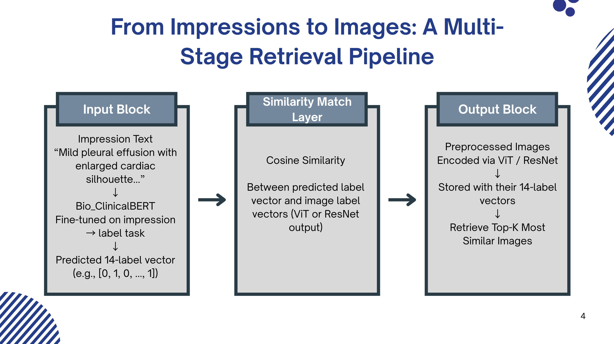
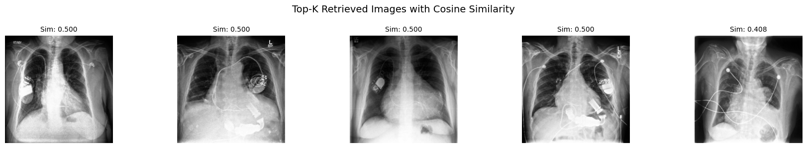

# 🩻 CheXRetriever: From Clinical Impressions to Chest X-ray Retrieval

**CheXRetriever** is a two-stage multimodal pipeline that takes free-text **radiology impressions** as input and retrieves the most relevant **chest X-ray images** from a labeled image database.

Built on the **CheXpert dataset**, this system bridges natural language and medical imaging using a combination of **Bio_ClinicalBERT**, **Vision Transformer (ViT)** and **ResNet-50** for multi-label classification and label-conditioned retrieval.

---

## Project Overview



1. **Stage 1 – Impression ➝ Label (Text Classification)**
   - Model: `Bio_ClinicalBERT`
   - Input: Free-text radiology impressions
   - Output: 14-label CheXpert disease vector

2. **Stage 2 – Label ➝ Image (Similarity Search)**
   - Models: `Vision Transformer (ViT)` and `ResNet-50`
   - Input: Predicted label vector
   - Output: Top-K most similar X-ray images via cosine similarity

---

## Folder Structure

```

CheXRetriever/
├── assets/                  # Model weights and tokenizer files
│   ├── best_resnet_finetuned.pt
│   ├── impressions_to_label_model/
│   ├── pipeline_diagram.png
│   ├── pubmedbert_tokenizer/
│   └── text_proj_head.pt

├── data/                    # Metadata and prediction outputs
│   ├── *_metadata_merged.csv
│   ├── *_inference_results*.csv

├── notebooks/               # All project notebooks
│   ├── bert_vit/            # BioClinicalBERT + ViT pipeline
│   ├── preprocessing/       # Data cleaning and prep
│   └── resnet/              # ResNet classification and retrieval

├── LICENSE
└── README.md

````

---

## Example Usage (Notebook based)

```python
# Step 1: Define your impression
impression = "Mild cardiomegaly and left pleural effusion"

# Step 2: Generate label vector using the prediction function
# (defined in the BioClinicalBERT notebook)
labels = predict_labels(impression)  # returns a dict of {label: 0 or 1}

# Step 3: Convert to vector format for retrieval
query_vector = [labels[label] for label in LABELS]

# Step 4: Load the predicted image label dataframe
df_preds = pd.read_csv("data/vit_label_to_image_inference_results_5.27.csv")

# Step 5: Retrieve top-5 most similar images using cosine similarity
top_images = retrieve_top_k_images(query_vector, df_preds, k=5)

# Step 6: Display them (helper function defined in the retrieval notebook)
visualize_top_k_images_with_scores(query_vector, df_preds, k=5)
````

### Output

Visual and score breakdown of retrieved images:




---

## Results (ResNet using Test Set)

| Metric        | ViT     | ResNet  | Better Performer |
|---------------|---------|---------|------------------|
| Recall@5      | 0.3268  | 0.4464  | ResNet       |
| mAP@5         | 0.0675  | 0.0622  | ViT (barely)     |
| Mean IOU@5    | 0.1780  | 0.2842  | ResNet       |

---

## Key Features

* 14-label multi-label classification from radiology text
* Fast cosine-similarity-based retrieval over 20K+ images
* Visual + quantitative evaluation (Recall, mAP, IOU)
* Compatible with Google Colab (A100 / T4) + GDrive paths
* Modular design for swapping BERT/ResNet with other models

---

## Dataset

* **[CheXpert Dataset (Stanford)](https://stanfordmlgroup.github.io/competitions/chexpert/)**
  224,316 chest X-rays from 65,240 patients with labeled observations.

> Note: You must manually download and register for the dataset.
> Image files are not included in this repo.

---

## Requirements

* Python 3.11+
* PyTorch
* Transformers (🤗)
* scikit-learn
* timm
* torchvision
* pandas, numpy

```bash
pip install -r requirements.txt
```

---

## Contributors

* Mahima Masetty
* Sara Chaker
* Soham Mandal
* Zeel Patel

---

## Future Work

- **End-to-End Retrieval**: Train models to go directly from text to images using contrastive (CLIP-style) learning.
- **Zero-Shot Classification**: Use prompts and few-shot examples to handle unseen conditions.
- **Explainability**: Add attention maps to visualize why images were retrieved.
- **Multi-Modal Pretraining**: Pretrain on large corpora of report–image pairs for better generalization.
- **Clinical Interface**: Build a lightweight tool for impression-based image search in EHR systems.

---

## License

MIT License — for academic use only.
Please review the [CheXpert dataset terms](https://stanfordmlgroup.github.io/competitions/chexpert/) before use.
